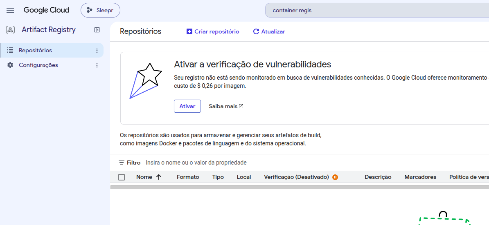
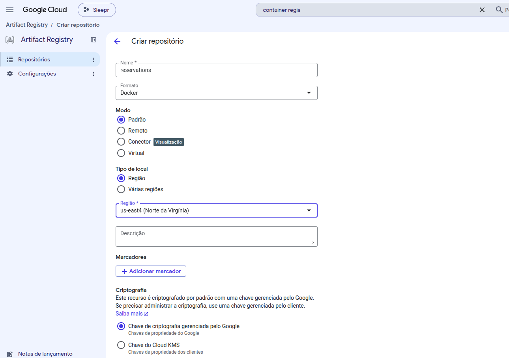
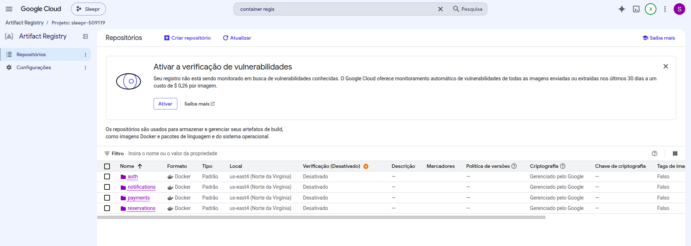
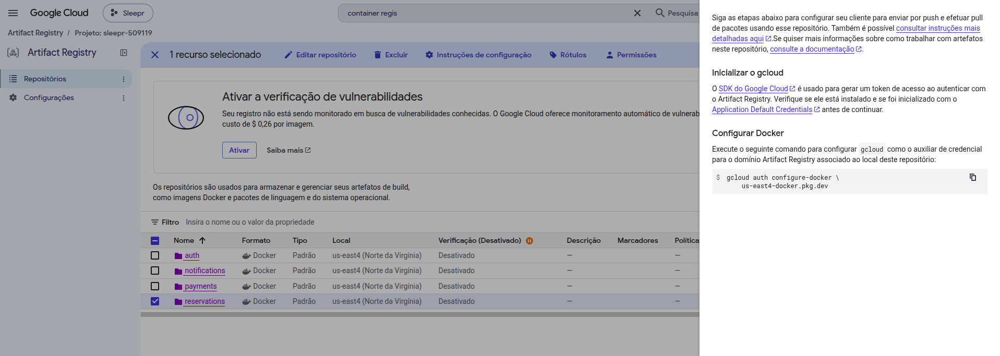
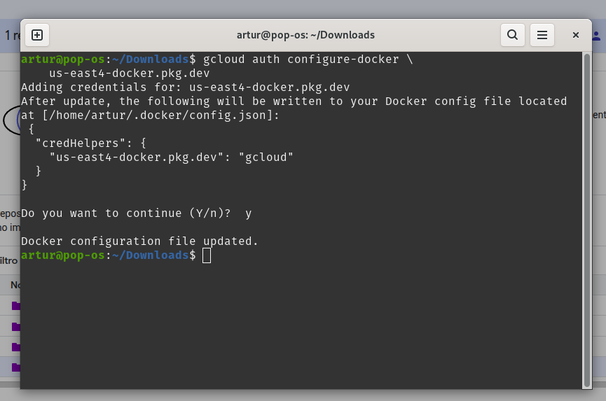
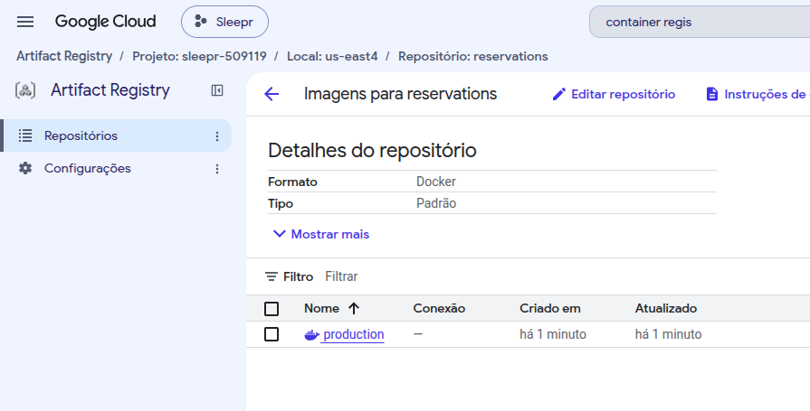

# Artifact Registry — publicando a imagem do `reservations` no Google Cloud

Primeiro passo do deploy: sair do `docker-compose` local e colocar a imagem de
cada microserviço em um registry na nuvem. O Artifact Registry é o serviço do
Google Cloud que guarda artefatos de build (imagens Docker, pacotes Maven, npm
etc.) em repositórios versionados na infraestrutura deles.

> No fluxo completo, o registry é só o **depósito**. Quem vai *rodar* a imagem
> depois é o Kubernetes/Cloud Run — mas ele precisa de um lugar de onde puxar, e
> esse lugar é o registry.

## 1. Ativar o recurso e criar os repositórios

Dentro do Google Cloud, buscamos por "Artifact Registry". Depois de ativar,
criamos um **repositório por microserviço** — `auth`, `reservations`,
`payments`, `notifications`:



Na criação, só foi preciso definir o **nome**, o **formato** (`Docker`) e a
**região** de hospedagem (`us-east4`), deixando o resto no padrão:



Com os quatro criados:



O mesmo, pelo terminal:

```bash
gcloud artifacts repositories list --location=us-east4
```

## 2. Instalar o CLI e autenticar

Para falar com o projeto a partir da máquina, é preciso o `gcloud` CLI, que tem
instalação rápida:



Depois de instalar, autentica com a conta do Google (o link aparece na mensagem
do próprio instalador):

```bash
gcloud auth login
gcloud config set project sleepr-509119
```

## 3. Configurar o Docker para usar o `gcloud` como credential helper

Com o CLI autenticado, rodamos o comando que o próprio console sugere:



```bash
gcloud auth configure-docker us-east4-docker.pkg.dev
```

Isso **não** faz login no Docker. Ele grava uma entrada em `~/.docker/config.json`:

```json
"credHelpers": {
  "us-east4-docker.pkg.dev": "gcloud"
}
```

Ou seja: sempre que o Docker precisar de credencial para esse host, ele chama o
`gcloud` para pegar um token na hora. Por isso o `docker push` funciona sem
pedir senha e não expira como um login manual.

## 4. Build da imagem

```bash
docker build -t reservations -f apps/reservations/Dockerfile .
```

Lendo o comando:

| parte | significado |
|---|---|
| `-t reservations` | *tag*: o nome local da imagem |
| `-f apps/reservations/Dockerfile` | **caminho do arquivo** Dockerfile |
| `.` | o **contexto de build** — a raiz do projeto |

O contexto precisa ser a raiz do monorepo (`.`, rodando de `~/Documents/Nest/sleepr`),
porque o Dockerfile faz `COPY package.json pnpm-lock.yaml ./` e `COPY . .` — ele
precisa enxergar `libs/`, `nest-cli.json` e os `tsconfig` para o `pnpm run build`
funcionar. Se o contexto fosse `apps/reservations`, esses arquivos não existiriam
lá dentro.

O `.dockerignore` na raiz (`node_modules`, `dist`, `.git`, `.env`) é o que evita
mandar centenas de MB inúteis para o daemon.

### ⚠️ Erro que tomei aqui

Rodando da raiz, tentei:

```bash
docker build -t reservations -f . ../../
```

```
=> => transferring dockerfile: 227.69MB
ERROR: failed to solve: failed to read dockerfile: . is not a regular file
```

Dois erros no mesmo comando:

1. **`-f .`** — o `-f` espera o *arquivo* Dockerfile, e eu passei um diretório.
   O BuildKit tentou ler a pasta inteira como se fosse o Dockerfile, daí o
   absurdo do `transferring dockerfile: 227.69MB` antes de falhar.
2. **`../../`** — esse contexto só faz sentido se você estiver *dentro* de
   `apps/reservations`. Rodando da raiz, ele apontava para `~/Documents`, fora
   do repositório.

As duas formas corretas, dependendo de onde você está:

```bash
# da raiz do projeto
docker build -t reservations -f apps/reservations/Dockerfile .

# de dentro de apps/reservations
docker build -t reservations -f Dockerfile ../../
```

A ordem é sempre `-f <dockerfile> <contexto>`.

## 5. Tag e push para o registry

O caminho copiado do console do Google Cloud é:

```
us-east4-docker.pkg.dev/sleepr-509119/reservations
```

Ele **para no repositório** — ainda falta o nome da imagem. Anatomia completa:

```
us-east4-docker.pkg.dev / sleepr-509119 / reservations / production : latest
└──────── host ────────┘ └── projeto ──┘ └── repo ────┘ └─ imagem ─┘ └ tag ┘
```

| parte | o que é |
|---|---|
| `us-east4-docker.pkg.dev` | host do Artifact Registry, derivado da **região** escolhida |
| `sleepr-509119` | ID do projeto no GCP |
| `reservations` | o **repositório** criado no passo 1 |
| `production` | o nome da **imagem** dentro do repositório (escolha minha) |
| `latest` | a tag; omitida, o Docker assume `latest` |

Então são dois comandos:

```bash
# 1. dar à imagem local o nome completo do destino
docker tag reservations:latest us-east4-docker.pkg.dev/sleepr-509119/reservations/production

# 2. enviar
docker push us-east4-docker.pkg.dev/sleepr-509119/reservations/production
```

O `docker tag` **não copia nem duplica** a imagem — ele só cria mais um nome
apontando para o mesmo ID. O registry de destino está embutido no próprio nome
da imagem; é assim que o `push` sabe para onde ir (sem prefixo, o Docker
assumiria Docker Hub).

Push concluído:

```
latest: digest: sha256:8565a44d51a53eedad9b89ba9533d86ef811d08db5172e27e052984730a2198d size: 856
```

E a imagem aparece dentro do repositório no console:



## 6. Polindo o Dockerfile — copiar só o necessário

O primeiro Dockerfile fazia `COPY . .`: jogava o monorepo inteiro para dentro da
imagem do `reservations`, incluindo `auth`, `payments` e `notifications`. Funciona,
mas é errado por dois motivos — a imagem carrega código de serviços que ela não
executa, e **qualquer** alteração em qualquer app invalida o cache de build.

A versão polida:

```dockerfile
COPY package.json pnpm-lock.yaml pnpm-workspace.yaml ./
RUN pnpm install

COPY nest-cli.json rspack.config.cjs tsconfig.json ./

COPY apps/reservations apps/reservations
COPY libs libs

RUN pnpm run build
```

A ordem importa: os **manifestos primeiro**, o `pnpm install`, e só depois o
código. Como cada instrução vira uma camada, enquanto `package.json` e
`pnpm-lock.yaml` não mudarem o Docker reaproveita a camada do install — mexer no
código não reinstala dependências.

Os três arquivos da raiz não são opcionais:

| arquivo | por que |
|---|---|
| `nest-cli.json` | `pnpm run build` é `nest build`; é aqui que está qual projeto compilar e qual builder usar |
| `rspack.config.cjs` | o builder configurado é o rspack, e o `nest-cli.json` aponta para este arquivo |
| `tsconfig.json` | é a base que o `apps/reservations/tsconfig.app.json` estende (`extends: "../../tsconfig.json"`) |
| `pnpm-workspace.yaml` | carrega o `allowBuilds` (ex.: `bcrypt: false`) |

### ⚠️ O erro do `UserDocument` — dependência invertida

Ao cortar o `COPY . .`, o build quebrou: `libs/common/src/decorators/current-user.decorator.ts`
importava assim:

```ts
import { UserDocument } from '../../../../apps/auth/src/users/models/users.schema.js';
```

Uma lib compartilhada subindo quatro níveis para pegar algo **dentro de um app**.
A seta de dependência estava ao contrário:

```
apps/auth   ──▶  libs/common     ✅ o esperado
libs/common ──▶  apps/auth       ❌ o que estava acontecendo
```

Enquanto o build copiava o repositório inteiro, o `apps/auth` estava lá e
ninguém percebia. Copiando só `apps/reservations` + `libs`, o TS não acha o
módulo — ou seja, a imagem do `reservations` **dependia do código-fonte do
`auth`**, o oposto da ideia de microserviços.

O instrutor resolve movendo o `users.schema.ts` para o `libs/common`. Isso
desinverte a seta, mas o schema do `User` é detalhe de persistência do `auth` —
só ele fala com a coleção `users`, e essa foi a justificativa de separar o
microserviço. Colocar o model no `common` dá a qualquer app o poder de importar
e mexer no banco alheio.

A correção que apliquei aqui não move nada: o decorator passa a usar o `UserDto`,
que **já existia** no `common` e é o formato que de fato atravessa a fronteira
TCP:

```ts
import { UserDto } from '../dto/user.dto.js';

function getCurrentUserByContext(ctx: ExecutionContext): UserDto {
```

Isso funciona porque o `createParamDecorator` **não tipa o parâmetro do handler** —
o tipo de retorno interno não limita quem chama. Cada app continua anotando o que
é verdade lá:

```ts
// apps/auth    → @CurrentUser() user: UserDocument   (documento Mongoose, _id: ObjectId)
// reservations → @CurrentUser() user: UserDto        (JSON do TCP, _id: string)
```

E, de quebra, corrige um tipo que estava mentindo: no `reservations` nunca houve
um `UserDocument` em `request.user`, e sim o JSON que voltou do `auth`.

**Lição geral:** um Dockerfile enxuto é um teste de arquitetura. Se a imagem de
um microserviço não compila sem o código-fonte de outro, a fronteira entre eles
não existe de verdade.

### Resultado

```
#17 [development 9/9] RUN pnpm run build
#17 0.255 $ nest build
#17 1.302 Rspack 2.2.2 compiled successfully in 37 ms
#17 DONE 1.4s
```

## 7. Encolhendo a imagem — de 601MB para 325MB

Medindo por dentro da imagem de 601MB:

```
/usr/local/lib/node_modules   75.5M   ← o pnpm instalado globalmente
/app/node_modules             95.4M   ← as 26 deps de produção do monorepo INTEIRO
/app/dist                      108K   ← o código
```

Dois desperdícios independentes, atacados separadamente.

### 7.1 O pnpm global no estágio de produção

O estágio final rodava `npm install -g pnpm` só para executar um `install`.
Isso custava 75MB de gerenciador de pacotes numa imagem que nunca mais vai
instalar nada.

A correção: o `node_modules` de produção é montado num estágio anterior e chega
pronto na imagem final, que não tem pnpm nem npm.

```dockerfile
FROM node:22-alpine AS production
WORKDIR /app
COPY --from=development /prod-deps/node_modules ./node_modules
COPY --from=development /app/dist ./dist
```

**601MB → 348MB.** Bem mais que os 75MB medidos, porque o `npm install -g`
também deixava cache para trás.

### 7.2 Um `package.json` por app (workspace pnpm)

O `pnpm install --prod` resolvia o `package.json` da **raiz**, que listava as
dependências dos quatro microserviços juntas. A imagem do `reservations`
carregava `stripe` (do `payments`), `nodemailer` (do `notifications`),
`passport`/`bcryptjs`/`@nestjs/jwt` (do `auth`).

Agora cada projeto declara o que usa:

| arquivo | conteúdo |
|---|---|
| `package.json` (raiz) | só o toolchain: `@nestjs/cli`, typescript, rspack, vitest, oxlint… |
| `libs/common/package.json` | o que a lib compartilhada importa (`@nestjs/*`, mongoose, class-validator, pino…) |
| `apps/<app>/package.json` | o que aquele microserviço importa + `"@app/common": "workspace:*"` |

E o `pnpm-workspace.yaml` passa a declarar os pacotes:

```yaml
packages:
  - 'apps/*'
  - 'libs/*'
```

No Dockerfile, o install fica filtrado e o `pnpm deploy` monta um `node_modules`
achatado e self-contained só com o runtime do app:

```dockerfile
COPY apps/reservations/package.json apps/reservations/
COPY libs/common/package.json libs/common/

RUN pnpm install --filter reservations...

# ... build ...

RUN pnpm deploy --filter reservations --prod /prod-deps
```

Os três pontos em `reservations...` significam "este projeto **e** suas
dependências dentro do workspace" — ou seja, o `@app/common` vem junto.

**348MB → 325MB** (`node_modules`: 95.4M → 76.1M).

> **Nota:** o vídeo faz isso com dois installs em sequência
> (`pnpm install` na raiz e depois `cd apps/<app> && pnpm install`), e o próprio
> instrutor avisa que o `pnpm install -r` pode travar. O `--filter` + `pnpm deploy`
> chega no mesmo lugar com um install só; se travar, o fallback dele funciona.

### Três tropeços no caminho

**1. `9 errors` do rspack em `client-kafka.js`, `server-mqtt.js`…**

O builder padrão do Nest usa `webpack-node-externals`, que monta a lista de
"não bundlar" **lendo os diretórios de `node_modules/` na raiz**. Com o
workspace, as dependências passam a viver em `apps/<app>/node_modules`, a lista
sai vazia, e o rspack tenta bundlar o `@nestjs/core` — engasgando nos `require`
opcionais dele (kafkajs, mqtt, nats, redis, amqplib).

A correção foi trocar a regra no `rspack.config.cjs` por uma que não depende de
onde o `node_modules` está:

```js
externals: [
  ({ request }, callback) => {
    const isLocal = !request || request.startsWith('.') ||
                    request.startsWith('/') || request.startsWith('@app/');
    return isLocal ? callback() : callback(null, `node-commonjs ${request}`);
  },
],
```

Tudo que não é caminho relativo/absoluto vira `require` externo. A exceção é o
`@app/common`, que é código nosso (path mapping do tsconfig) e precisa entrar no
bundle.

**2. `pnpm deploy` virou `nest deploy`**

O `package.json` tinha um script `"deploy": "nest deploy"`, e o `pnpm deploy`
roda o **script** em vez do comando nativo. Renomeado para `deploy:mau`.

**3. `Cannot deploy more than 1 project`**

O `package.json` da raiz também se chamava `reservations`, igual ao do app — o
`--filter reservations` casava com dois projetos. A raiz virou `sleepr`.

### Onde os 325MB estão agora

```
node:22-alpine (base)   ~240M
/app/node_modules        76M
/app/dist               108K
```

Metade do `node_modules` restante é legítima: `es-toolkit` (13M, vem do
`@nestjs/config`), `libphonenumber-js` (10.7M, vem do `class-validator`) e
`rxjs` (10.7M) — todos usados de verdade pelo `reservations`.

## 8. Os outros três microserviços

O mesmo Dockerfile serve aos quatro apps — só muda o nome em três lugares
(`--filter`, os `COPY` e o `CMD`). Dois detalhes apareceram ao replicar.

### O `nest build` compilava o app errado

Os Dockerfiles do `auth`, `payments` e `notifications` rodavam:

```dockerfile
RUN pnpm run build
```

`nest build` **sem argumento** compila o projeto `root` do `nest-cli.json` — que
é o `reservations`. Ou seja, as três imagens estavam empacotando o bundle do
`reservations` e só não explodiam porque o `CMD` apontava para um caminho que
não existia. O correto:

```dockerfile
RUN pnpm run build payments
```

### `Cannot find module 'class-transformer'` no `payments`

O `payments` subiu com `MODULE_NOT_FOUND`. A causa é a interação entre o bundle
e o workspace: o rspack **embute** o código do `@app/common` no `main.js` do
app, mas as dependências externas continuam sendo `require` em runtime. Como o
require sai de `/app/dist/...`, ele resolve em `/app/node_modules` — nível raiz.
E o `pnpm deploy` aninha as deps do `@app/common` dentro de
`node_modules/@app/common/node_modules`.

Resultado: **toda dependência que o app puxa através do `common` precisa estar
declarada também no `package.json` do app.** O `payments` usa os DTOs do common,
que usam `class-transformer` — faltava declarar.

Para conferir isso sem adivinhar, dá para ler os `require` do próprio bundle:

```bash
docker run --rm --entrypoint sh payments -c "cat /app/dist/apps/payments/src/main.js" \
  | grep -oP 'require\("\K[^"./][^"]*' | sort -u
```

O que sair daí tem que existir no `package.json` do app.

### Resultado final

| app | imagem | antes |
|---|---|---|
| `reservations` | 325MB | 601MB |
| `auth` | 330MB | — |
| `payments` | 344MB | — |
| `notifications` | 327MB | — |

Os quatro sobem até a validação das variáveis de ambiente (`Config validation
error: ... is required`), que é o esperado sem `.env` — nenhum
`MODULE_NOT_FOUND`.

E os quatro estão publicados:

```
us-east4-docker.pkg.dev/sleepr-509119/reservations/production
us-east4-docker.pkg.dev/sleepr-509119/auth/production
us-east4-docker.pkg.dev/sleepr-509119/payments/production
us-east4-docker.pkg.dev/sleepr-509119/notifications/production
```

## Resumo dos comandos

```bash
gcloud auth login
gcloud config set project sleepr-509119
gcloud auth configure-docker us-east4-docker.pkg.dev

docker build -t reservations -f apps/reservations/Dockerfile .
docker tag reservations:latest us-east4-docker.pkg.dev/sleepr-509119/reservations/production
docker push us-east4-docker.pkg.dev/sleepr-509119/reservations/production
```

Para os outros microserviços é a mesma sequência, trocando `reservations` por
`auth`, `payments` ou `notifications` — no `-f`, no `-t` e no caminho do repo.
Em loop:

```bash
for a in reservations auth payments notifications; do
  docker build -t $a -f apps/$a/Dockerfile .
  docker tag $a:latest us-east4-docker.pkg.dev/sleepr-509119/$a/production
  docker push us-east4-docker.pkg.dev/sleepr-509119/$a/production
done
```

## Pendências / observações

- O `dist/` no host pertence ao `root` (criado pelo container via volume do
  `docker-compose`), então `pnpm run build` e `tsc -b` na máquina falham com
  `EACCES`. Resolver com `sudo chown -R $USER dist` ou rodando o container com
  o UID do host.
- As dependências que um app usa **através** do `@app/common` precisam ser
  declaradas no `package.json` dele (ver 8). Não há nada verificando isso: se um
  dia um app passar a usar uma parte nova do common, o erro só aparece em
  runtime, dentro do container.
- O `docker-compose.yaml` ainda aponta para os builds locais; falta decidir se
  ele passa a usar as imagens do registry.
- Próximo passo do curso: rodar essas imagens no Kubernetes (GKE) — o registry
  já é o lugar de onde o cluster vai puxar.
